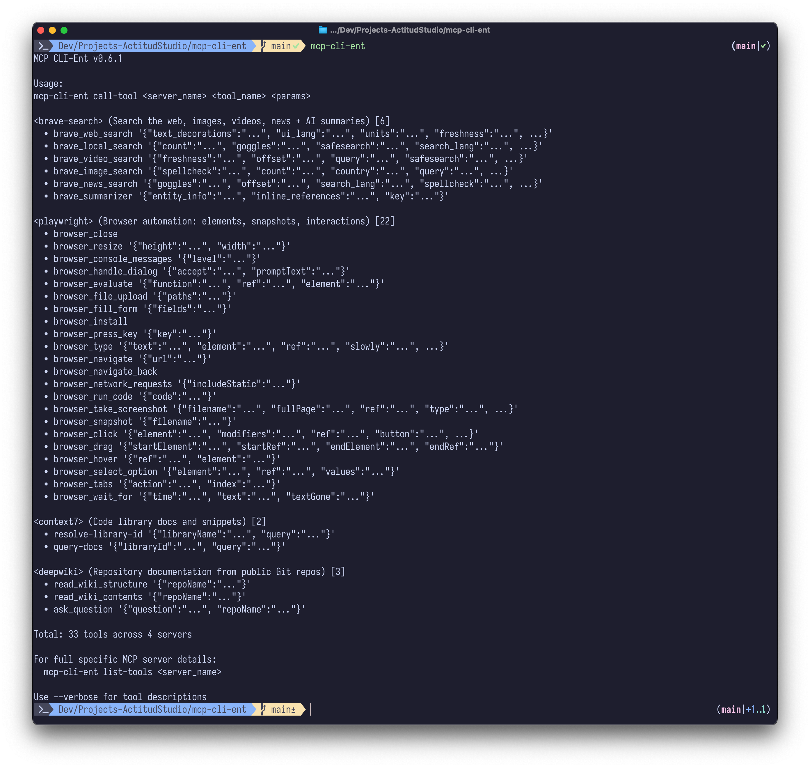

# MCP CLI-Ent

<p align="center">
  <br/>
  <em>"Do not be hasty."</em>
</p>

Use MCP servers without loading them into your agent's context window.

**CLI-Ent** = CLI tool + Context Guardian. Instead of loading MCP tool definitions into your agent's context, use `mcp-cli-ent` to call tools on-demand.

### Key Features
- **Cross-Platform**: Works on Linux, macOS, Windows
- **Zero Dependencies**: Single binary, no runtime requirements
- **Universal Config**: Compatible with existing MCP configurations
- **Dual Transport**: HTTP and stdio-based servers
- **Multi-Server**: Manage multiple MCP servers easily
- **Secure**: Environment variable substitution for credentials
- **Smart Output**: Intelligent handling of binary data and images
- **Auto-Start Daemon**: Browser sessions created automatically

## Quick Install

**Homebrew (Linux, WSL & macOS):**

```bash
brew install EstebanForge/tap/mcp-cli-ent
```

**Direct binary install (Linux, WSL & macOS):**

```bash
curl -fsSL https://raw.githubusercontent.com/EstebanForge/mcp-cli-ent/main/scripts/install.sh | bash
```

**Windows (PowerShell):**

```powershell
Invoke-WebRequest -Uri "https://raw.githubusercontent.com/EstebanForge/mcp-cli-ent/main/scripts/install.ps1" -OutFile "install.ps1"
Set-ExecutionPolicy -ExecutionPolicy RemoteSigned -Scope Process -Force
.\install.ps1
```

Note: Windows support is experimental. Contributions and testing are welcome. If you encounter issues, please use Windows WSL (Linux) instead of the Windows executable.

## Quick Start

```bash
# Create configuration
mcp-cli-ent create-config

# List available servers
mcp-cli-ent

# List tools from a server
mcp-cli-ent list-tools context7

# Call a tool (get library docs via context7)
mcp-cli-ent call-tool context7 get-library-docs '{
  "context7CompatibleLibraryID": "/EstebanForge/hyperpress",
  "query": "how to create a custom block"
}'
```

## Screenshots

Tool Execution - Getting Documentation via Context7




## For AI Agents

Add to your `AGENTS.md` (or `CLAUDE.md`, thank you for not following standards):

```markdown
Use MCP servers with CLI tool: `mcp-cli-ent`
```

Or:

```markdown
MCP (Model Context Protocol) connects external tools. Use servers to fetch live docs, run complex reasoning, or automate browsers. Use them with CLI tool: `mcp-cli-ent`
```

## Configuration

### Config File Location

```bash
# Create config in standard location (~/.config/mcp-cli-ent/mcp_servers.json)
mcp-cli-ent create-config
```

**Discovery priority:**
1. `--config <path>` flag
2. `~/.config/mcp-cli-ent/mcp_servers.json` (Linux/macOS)
3. `%APPDATA%\mcp-cli-ent\mcp_servers.json` (Windows)
4. `./mcp_servers.json` (current directory)

### JSON Configuration Reference

```json
{
  "mcpServers": {
    "server-name": {
      "enabled": true,
      "description": "Human-readable description",
      "type": "http",
      "url": "https://example.com/mcp",
      "command": "npx",
      "args": ["-y", "package-name"],
      "env": {
        "API_KEY": "${ENV_VAR_NAME}"
      },
      "headers": {
        "Authorization": "Bearer ${TOKEN}"
      },
      "timeout": 30,
      "persistent": false,
      "session": {
        "type": "persistent",
        "autoStart": true,
        "timeout": 300,
        "maxIdle": 600,
        "healthCheck": true
      }
    }
  }
}
```

### Server Configuration Keys

| Key | Type | Default | Description |
|-----|------|---------|-------------|
| `enabled` | bool | `true` | Enable/disable server |
| `description` | string | - | Human-readable description (shown in tool listings) |
| `type` | string | auto | Transport type: `"http"` or `"stdio"` (auto-detected) |
| `url` | string | - | URL for HTTP servers |
| `command` | string | - | Command for stdio servers (e.g., `npx`, `uvx`) |
| `args` | string[] | `[]` | Command arguments |
| `env` | object | `{}` | Environment variables for the process |
| `headers` | object | `{}` | HTTP headers (HTTP servers only) |
| `timeout` | int | `30` | Request timeout in seconds |
| `persistent` | bool | `false` | Enable daemon-managed persistent sessions |

### Session Configuration (Optional)

| Key | Type | Default | Description |
|-----|------|---------|-------------|
| `session.type` | string | auto | `"persistent"`, `"stateless"`, or `"hybrid"` |
| `session.autoStart` | bool | `false` | Auto-start session on first use |
| `session.timeout` | int | `300` | Session timeout in seconds |
| `session.maxIdle` | int | `600` | Max idle time before auto-stop |
| `session.healthCheck` | bool | `false` | Enable periodic health checks |

### Environment Variable Substitution

Use `${VAR_NAME}` or `$VAR_NAME` in values:

```json
{
  "args": ["--api-key", "${ENT_CONTEXT7_API_KEY}"],
  "env": { "API_KEY": "$MY_API_KEY" },
  "headers": { "Authorization": "Bearer ${TOKEN}" }
}
```

```bash
# Linux/macOS
export ENT_CONTEXT7_API_KEY="your_key"
export ENT_BRAVE_API_KEY="your_key"

# Windows PowerShell
$env:ENT_CONTEXT7_API_KEY = "your_key"
```

### Pre-configured Servers

The example config includes:

| Server | Description |
|--------|-------------|
| `chrome-devtools` | Browser automation: console, navigation, screenshots |
| `playwright` | Browser automation: elements, snapshots, interactions |
| `context7` | Code library docs and snippets |
| `sequential-thinking` | Problem-solving and planning |
| `deepwiki` | Repository documentation from public Git repos |
| `brave-search` | Web search, images, videos, news + AI summaries |
| `time` | Current time and timezone conversions |
| `cipher` | Memory layer for coding agents |

## CLI Reference

### Global Flags

| Flag | Short | Default | Description |
|------|-------|---------|-------------|
| `--config` | - | auto | Configuration file path |
| `--verbose` | `-v` | `false` | Verbose output (shows tool descriptions) |
| `--timeout` | - | `30` | Request timeout in seconds |
| `--refresh` | - | `false` | Force refresh tools cache |
| `--clear-cache` | - | `false` | Clear tools cache (alias for `--refresh`) |

### Commands

```bash
# Server management
mcp-cli-ent                           # Show all tools from all servers
mcp-cli-ent list-servers              # List enabled servers
mcp-cli-ent list-servers --all        # Include disabled servers
mcp-cli-ent list-tools [server]       # List tools (all or specific server)

# Tool execution
mcp-cli-ent call-tool <server> <tool> [json-args]

# Configuration
mcp-cli-ent create-config [filename]  # Create example config
mcp-cli-ent version                   # Show version info

# Session management
mcp-cli-ent session list              # List active sessions
mcp-cli-ent session status <server>   # Show session status
mcp-cli-ent session start <server>    # Start persistent session
mcp-cli-ent session stop <server>     # Stop session
mcp-cli-ent session restart <server>  # Restart session
mcp-cli-ent session attach <server>   # Attach to existing session
mcp-cli-ent session cleanup           # Clean up dead sessions

# Daemon management
mcp-cli-ent daemon start              # Start daemon (background)
mcp-cli-ent daemon start --foreground # Start daemon (foreground)
mcp-cli-ent daemon stop               # Stop daemon
mcp-cli-ent daemon status             # Show daemon status
mcp-cli-ent daemon restart            # Restart daemon
mcp-cli-ent daemon logs               # Show daemon logs
mcp-cli-ent daemon logs --tail 100    # Show last 100 log lines
```

## Browser Automation

Persistent browser automation (Chrome DevTools, Playwright) works automatically. Just call the tools:

```bash
mcp-cli-ent call-tool chrome-devtools navigate_page '{"url": "https://example.com"}'
mcp-cli-ent call-tool chrome-devtools take_screenshot
```

The daemon starts automatically when you use these tools.

## Build from Source

```bash
git clone https://github.com/EstebanForge/mcp-cli-ent.git
cd mcp-cli-ent
make build
```

**Requirements:** Go 1.21+

### Build Commands

```bash
make build          # Build for current platform
make build-all      # Build for all platforms
make dev-setup      # Development setup
make test           # Run tests
make test-coverage  # Run tests with coverage
make fmt            # Format code
make lint           # Lint code
```

## Security & Build Integrity

MCP CLI-Ent uses automated, reproducible builds through GitHub Actions:

- **CI/CD Pipeline**: All releases built automatically via GitHub Actions
- **No Manual Builds**: Prevents tampering by never building locally
- **Reproducible Builds**: Every build traceable to source commits
- **Automated Testing**: Each build passes comprehensive tests
- **Cryptographic Verification**: Release artifacts include SHA256 checksums

### Verify Downloads

```bash
# Verify checksum (provided in release notes)
sha256sum mcp-cli-ent-linux-amd64
```

**Trust, but verify.** Always download from official GitHub releases and verify checksums.

## License

[MIT](LICENSE.md)
