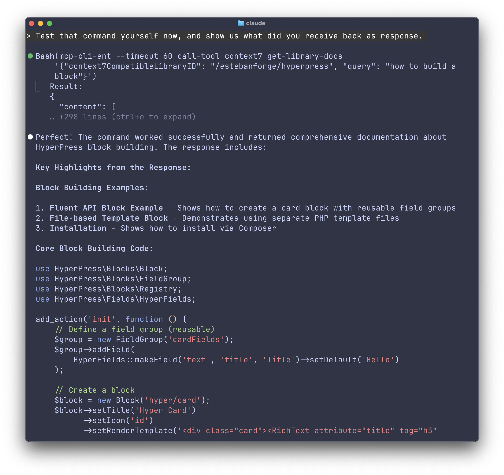
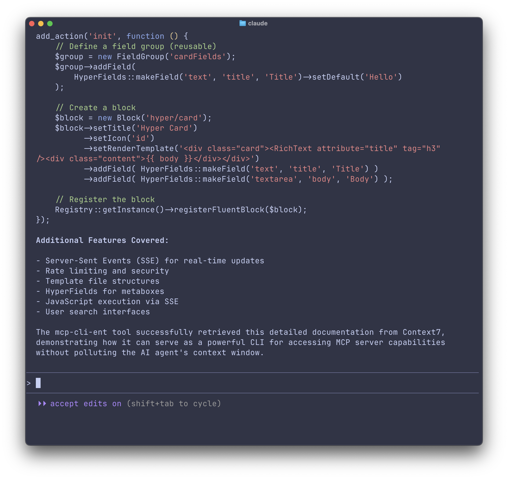

# MCP CLI-Ent

*"Do not be hasty."*

Access MCP servers without loading them into your agent's context window.

**CLI-Ent** = CLI tool + Context Guardian. Instead of loading MCP tool definitions into your agent's context, use `mcp-cli-ent` to call tools on-demand.

### Key Features
- **Cross-Platform**: Works on Linux, macOS, Windows
- **Zero Dependencies**: Single binary, no runtime requirements
- **Universal Config**: Compatible with existing MCP configurations
- **Dual Transport**: HTTP and stdio-based servers
- **Multi-Server**: Manage multiple MCP servers easily
- **Secure**: Environment variable substitution for credentials
- **Smart Output**: Intelligent handling of binary data and images
- **Auto-Start Daemon**: Browser sessions created automatically

## Quick Install

**Linux, macOS & Windows WSL:**

```bash
curl -fsSL https://raw.githubusercontent.com/EstebanForge/mcp-cli-ent/main/scripts/install.sh | bash
```

**Windows (PowerShell):**

```powershell
Invoke-WebRequest -Uri "https://raw.githubusercontent.com/EstebanForge/mcp-cli-ent/main/scripts/install.ps1" -OutFile "install.ps1"
Set-ExecutionPolicy -ExecutionPolicy RemoteSigned -Scope Process -Force
.\install.ps1
```

Note: Windows support is experimental. Contributions and testing are welcome. If you encounter issues, please use Windows WSL (Linux) instead of the Windows executable.

## Quick Start

```bash
# Create configuration
mcp-cli-ent create-config

# List available servers
mcp-cli-ent list-servers

# List tools from a server
mcp-cli-ent list-tools sequential-thinking

# Call a tool (get library docs via context7)
mcp-cli-ent call-tool context7 get-library-docs '{
  "context7CompatibleLibraryID": "/EstebanForge/hyperpress",
  "query": "how to create a custom block"
}'
```

## Screenshots

Tool Execution - Getting Documentation via Context7



## For AI Agents

Add to your `CLAUDE.md`:

```markdown
To access MCP servers, use the CLI command tool: `mcp-cli-ent`
```

Or:

```markdown
MCP (Model Context Protocol) bridges external tools. Use servers to fetch live docs, perform complex reasoning, or automate browsers. Access via `mcp-cli-ent`
```

## Configuration

Create `~/.config/mcp-cli-ent/mcp_servers.json`:

```bash
mcp-cli-ent create-config
```

Or copy from `mcp_servers.example.json` which comes with a list of pre-loaded MCP servers:

- **sequential-thinking** | Problem-solving and planning
- **deepwiki** | Repository documentation
- **context7** | Library documentation
- **chrome-devtools** | Browser automation
- **time** | Time and timezone
- **brave-search** | Web search
- **cipher** | Memory layer

### API Keys

Some servers need environment variables:

```bash
# Linux/macOS
export ENT_CONTEXT7_API_KEY="your_key"
export ENT_BRAVE_API_KEY="your_key"

# Windows
$env:ENT_CONTEXT7_API_KEY = "your_key"
```

See full config format in `mcp_servers.example.json`.

## Commands

```bash
mcp-cli-ent list-servers              # List enabled servers
mcp-cli-ent list-servers --all        # List all servers (enabled/disabled)
mcp-cli-ent list-tools [server]       # List tools from server
mcp-cli-ent call-tool <server> <tool> [args]  # Call a tool
mcp-cli-ent list-resources <server>   # List server resources
mcp-cli-ent version                   # Show version
```

## Browser Automation

Persistent browser automation (Chrome DevTools, Playwright) works automatically. Just call the tools:

```bash
mcp-cli-ent call-tool chrome-devtools navigate_page '{"url": "https://example.com"}'
mcp-cli-ent call-tool chrome-devtools take_screenshot
```

The daemon starts automatically when you use these tools.

## Build from Source

```bash
git clone https://github.com/EstebanForge/mcp-cli-ent.git
cd mcp-cli-ent
make build
```

**Requirements:** Go 1.21+

### Build Commands

```bash
make build          # Build for current platform
make build-all      # Build for all platforms
make dev-setup      # Development setup
make test           # Run tests
make test-coverage  # Run tests with coverage
make fmt            # Format code
make lint           # Lint code
```

## Security & Build Integrity

MCP CLI-Ent uses automated, reproducible builds through GitHub Actions:

- **CI/CD Pipeline**: All releases built automatically via GitHub Actions
- **No Manual Builds**: Prevents tampering by never building locally
- **Reproducible Builds**: Every build traceable to source commits
- **Automated Testing**: Each build passes comprehensive tests
- **Cryptographic Verification**: Release artifacts include SHA256 checksums

### Verify Downloads

```bash
# Verify checksum (provided in release notes)
sha256sum mcp-cli-ent-linux-amd64
```

**Trust, but verify.** Always download from official GitHub releases and verify checksums.

## License

[MIT](LICENSE.md)
